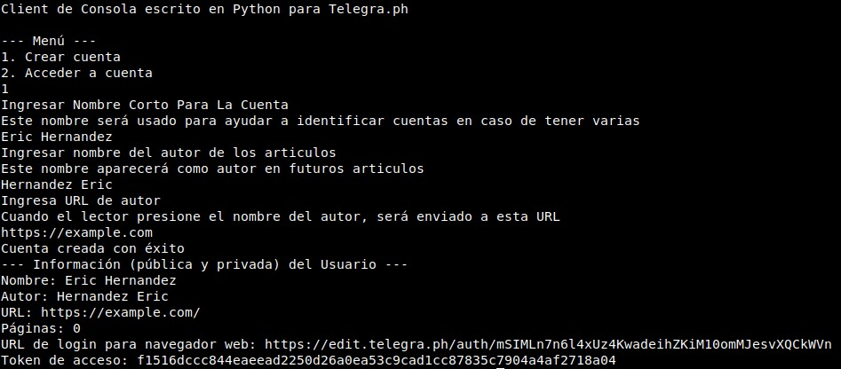
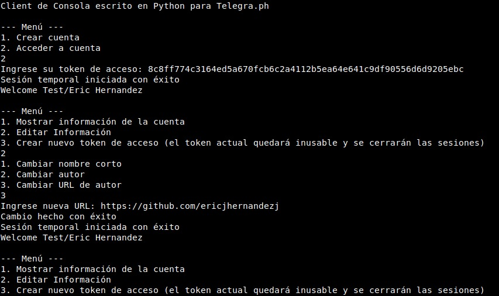

# Python Telegraph CLI Client

Cliente de consola escrito en Python para Telegraph [Telegraph](https://telegra.ph), herramienta de Blogging minimalista desarrollada por Telegram.

**v1.0.1**
## Usar Localmente

Solo necesitas Python3 y acceso a Internet

```bash
git clone https://github.com/ericjhernandezj/py-telegraph-cli-client.git
cd py-telegraph-cli-client/
python3 src/main.py
```

Si este programa será ejecutado en Windows, ir a la función `clear()` y cambiar
`system("clear")` por `system("cls")`.
## Funcionalidades

- Permite crear una cuenta en Telegraph desde la consola, devolviendo un token de acceso y un enlace para iniciar sesión en un navegador web.
- Permite iniciar sesión en una cuenta existente para ver y modificar información de la cuenta, incluso generar nuevo token de acceso y cerrar sesiones.

## Cómo Contribuir

- Haz fork de este repositorio.
- Haz los cambios que consideres útiles o necesarios.
- Crea un Pull Request

Recuerda crear un commit por cada cambio independiente en tu PR. De esa forma será más fácil de analizar y realizar el merge.

También puedes crear un Issue con sugerencias o ideas.

## Capturas de Pantalla

Creando una cuenta


Iniciando sesión


## To-Do

- [x] Ordenar funciones de acuerdo a su relevancia
- [x] Usar tipado estático con `mypy`
- [x] Agregar timeout a peticiones. [Read more](https://pylint.readthedocs.io/en/latest/user_guide/messages/warning/missing-timeout.html)
- [ ] `str(input())` to `input()` when input is `str`
- [ ] Opción para salir del menú de `login()`
- [ ] Usar `clear()` cuando sea necesario
- [ ] Agregar comentarios necesarios
- [ ] Agregar validaciones
- [ ] Use English as main language
- [ ] `createAccount()` - Hacer `author_url` opcional
- [ ] `login()` - Agregar opciones para:
	- [ ] Crear articulo
	- [ ] Editar artículo
	- [ ] Ver todos los artículos
	- [ ] Ver artículo específico
	- [ ] Ver vistas de artículo
- [ ] Crear documentación del proyecto usando plantilla de GitHub Pages

## Licencia

[MIT](https://choosealicense.com/licenses/mit/)

## Autores

- [@ericjhernandezj](https://github.com/ericjhernandezj)
